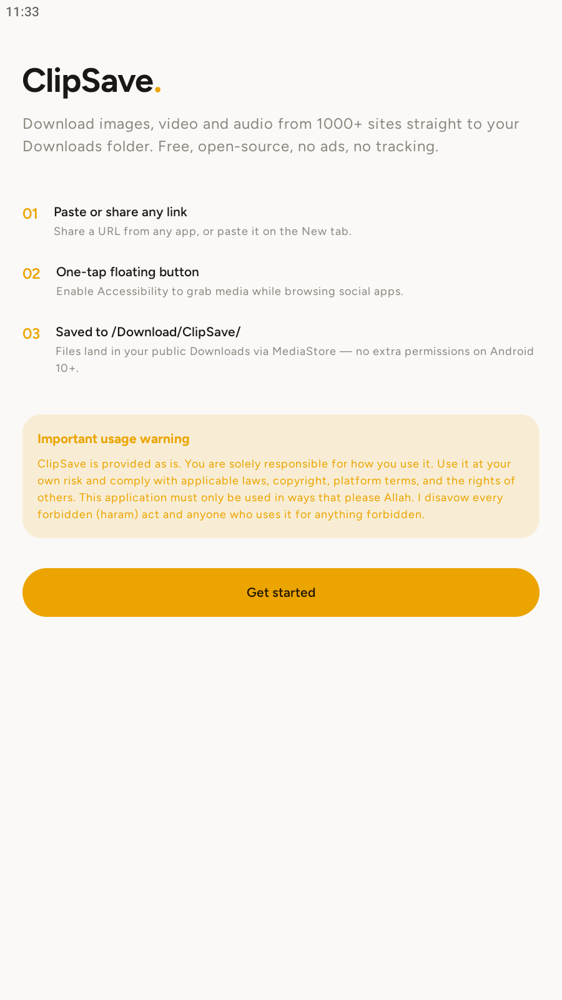
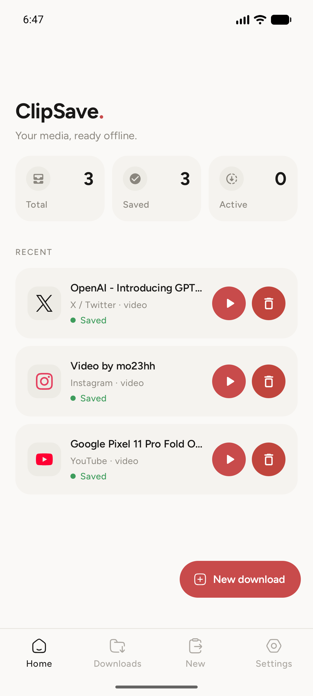
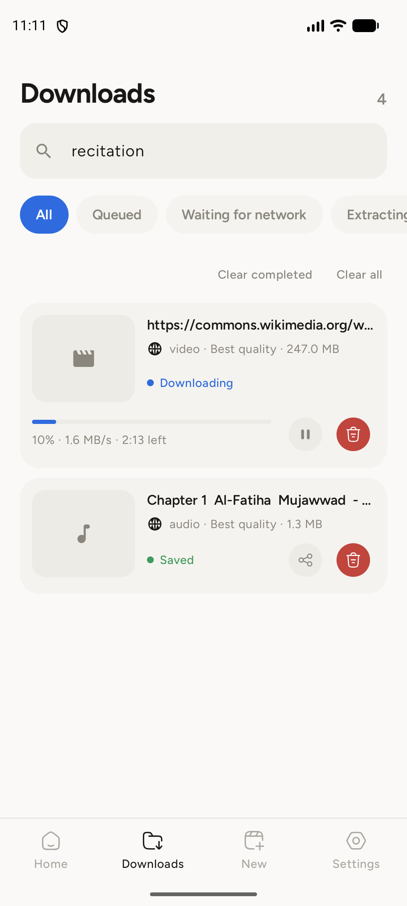
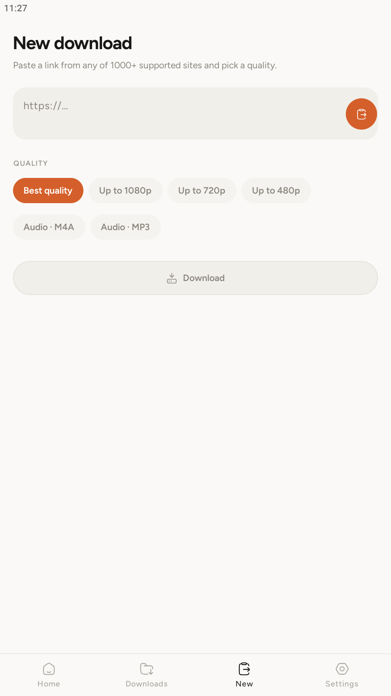
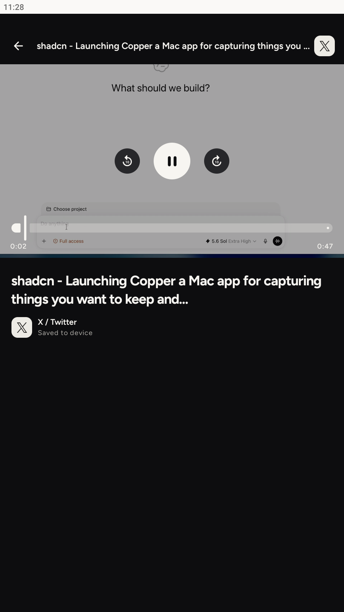
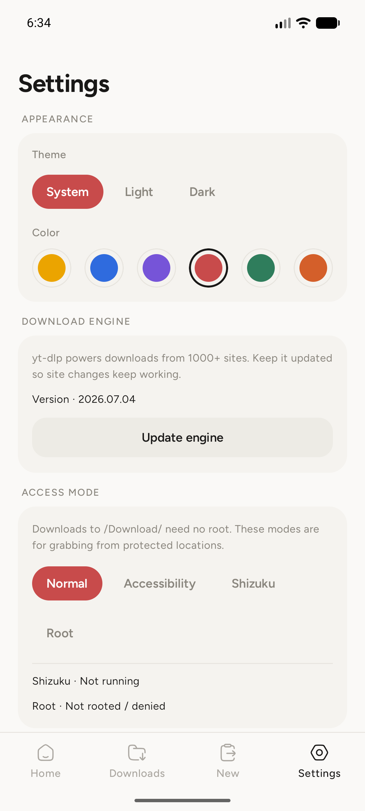
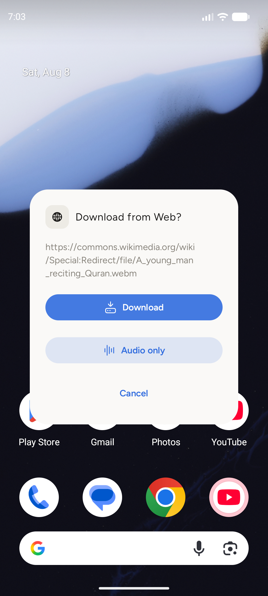

[](https://thebsd.github.io/StandWithPalestine)

# ClipSave


**Free, open-source media downloader for Android.** Grab images, video, and audio from
1000+ websites — YouTube, Instagram, TikTok, X/Twitter, Reddit, Facebook, Pinterest,
Twitch, Vimeo, SoundCloud, Bilibili, and many more — straight to
`/storage/emulated/0/Download/ClipSave/`.

No ads. No telemetry. No tracking. MIT licensed.

---

## App preview

<table>
  <tr>
    <td align="center" width="33%">
      <br>
      <strong>Onboarding</strong><br>
      <sub>A clear introduction to the download flow.</sub>
    </td>
    <td align="center" width="33%">
      <br>
      <strong>Home</strong><br>
      <sub>At-a-glance activity and recent downloads.</sub>
    </td>
    <td align="center" width="33%">
      <br>
      <strong>Downloads</strong><br>
      <sub>Search, filter, retry, play, and manage files.</sub>
    </td>
  </tr>
  <tr>
    <td align="center" width="33%">
      <br>
      <strong>New download</strong><br>
      <sub>Paste a link and choose video or audio quality.</sub>
    </td>
    <td align="center" width="33%">
      <br>
      <strong>Video player</strong><br>
      <sub>Clean playback with seeking and skip controls.</sub>
    </td>
    <td align="center" width="33%">
      <br>
      <strong>Settings</strong><br>
      <sub>Theme, accent color, engine, and access controls.</sub>
    </td>
  </tr>
</table>

<p align="center">
  <br>
  <strong>Share from any app</strong><br>
  <sub>Send a link to ClipSave and choose video or audio without retyping it.</sub>
</p>

---

## Features

- **1000+ sites** via a bundled **yt-dlp** engine (with **ffmpeg** merging + **aria2c**).
- **Automatic platform detection** with recognizable icons for popular services.
- **Metadata-scraper fallback** for supported pure image posts.
- **Reddit** handled natively through the public JSON API.
- **Share to ClipSave** — share any link from any app to download it.
- **One-tap floating button** (Accessibility) while browsing Instagram / TikTok / X.
- **Audio-only** extraction (m4a) for any supported video.
- **Batch downloads** from pasted or shared text with automatic link deduplication.
- **Pause and resume** with retained yt-dlp partial files, including process-death recovery.
- **Resource-aware queue** capped at two concurrent engine jobs for predictable memory and battery use.
- **Foreground service** downloads with live progress notifications.
- **In-app video player** with seeking and 10-second skip controls.
- **Material 3** UI with light / dark / system modes and six saved accent colors.
- **Downloads manager**: search, filter, retry failed, delete, clear.
- Saves through **MediaStore** — no storage permission needed on Android 10+.
- **Shizuku / root status** surfaced in Settings (downloads need neither).

## Build

The app builds on **GitHub Actions** automatically on every push to `main`
(`.github/workflows/android.yml`). It produces:

- `ClipSave-debug` — installable debug APK (always).
- `ClipSave-release-unsigned` — when no signing secrets are set.
- `ClipSave-release-signed` — when keystore secrets are configured.

### Local build

```bash
./gradlew :app:assembleDebug
# output: app/build/outputs/apk/debug/app-debug.apk
```

Requirements: JDK 17, Android SDK 35.

## Tech

- Kotlin 2.1 · Jetpack Compose · Material 3
- AGP 8.8.0 · Gradle 8.10.2 · single-module, **manual DI** (no Hilt/KSP)
- OkHttp · kotlinx.serialization · DataStore
- youtubedl-android (yt-dlp) 0.18.1 · ffmpeg · aria2c
- min SDK 26 (Android 8.0) · target SDK 35 (Android 15)

## ⚠️ Important Usage Warning

> [!WARNING]
> **English:** ClipSave is provided “as is” and without warranty. You are solely responsible for how you use it. Use it at your own risk and comply with applicable laws, copyright, platform terms, and the rights of others. To the extent permitted by law, the developer accepts no liability for misuse or resulting damage. This application must only be used in ways that please Allah. I disavow every forbidden (haram) act and anyone who uses this application for anything forbidden.

<details>
<summary><strong>العربية</strong></summary>

> [!WARNING]
> يُقدَّم ClipSave «كما هو» من دون أي ضمان. أنت وحدك المسؤول عن طريقة استخدامه، وتستخدمه على مسؤوليتك الخاصة، مع الالتزام بالقوانين وحقوق النشر وشروط المنصات وحقوق الآخرين. في الحدود التي يسمح بها القانون، لا يتحمل المطوّر مسؤولية إساءة الاستخدام أو الأضرار الناتجة عنها. هذا التطبيق يجب أن يُستخدم فيما يُرضي الله، وأنا أتبرأ من أي فعل حرام أو من أي شخص يستخدم هذا التطبيق في أي شيء حرام.

</details>

<details>
<summary><strong>Français</strong></summary>

> [!WARNING]
> ClipSave est fourni « en l’état », sans aucune garantie. Vous êtes seul responsable de son utilisation et l’utilisez à vos propres risques, dans le respect des lois, des droits d’auteur, des conditions des plateformes et des droits d’autrui. Dans les limites autorisées par la loi, le développeur décline toute responsabilité en cas d’utilisation abusive ou de dommage en résultant. Cette application doit uniquement être utilisée d’une manière qui agrée à Allah. Je me désavoue de tout acte interdit (haram) et de toute personne qui utilise cette application à des fins interdites.

</details>

<details>
<summary><strong>简体中文</strong></summary>

> [!WARNING]
> ClipSave 按“原样”提供，不作任何保证。您应对自己的使用方式承担全部责任，并自行承担使用风险，同时遵守适用法律、版权、平台条款及他人权利。在法律允许的范围内，开发者不对滥用或由此造成的损害承担责任。本应用只能用于真主所喜悦之事。对于任何被禁止（哈拉姆）的行为，以及任何将本应用用于被禁止之事的人，我均声明与其行为无关。

</details>

<details>
<summary><strong>Русский</strong></summary>

> [!WARNING]
> ClipSave предоставляется «как есть», без каких-либо гарантий. Вы несёте полную ответственность за его использование и используете его на свой страх и риск, соблюдая применимые законы, авторские права, условия платформ и права других лиц. В пределах, допускаемых законом, разработчик не несёт ответственности за неправомерное использование или возникший ущерб. Это приложение следует использовать только в том, чем доволен Аллах. Я не имею отношения к любым запретным (харам) действиям и к любому человеку, использующему это приложение для чего-либо запретного.

</details>

## License

ClipSave is released under the [MIT License](LICENSE).

## Credits

ClipSave is based on the original [MediaGrab project](https://github.com/omersusin/MediaGrab).

> Personal use. Respect the terms of service and copyright of the platforms you download from.

## Star History

<a href="https://www.star-history.com/?repos=abdellatif-laghjaj%2FClipSave&type=date&legend=top-left">
 <picture>
   <source media="(prefers-color-scheme: dark)" srcset="https://api.star-history.com/chart?repos=abdellatif-laghjaj/ClipSave&type=date&theme=dark&legend=top-left&sealed_token=9lg5BUXsdT8tTZy5BJHNNqXtQu7b8dFPvOegIWUdnSjX0fqH9sNdXHflpilSim7z6Ss3_nVmvWMjTfQx6pkujXB8jGUfNjhoKe08TuNh6SF3QGueIgdmIQ" />
   <source media="(prefers-color-scheme: light)" srcset="https://api.star-history.com/chart?repos=abdellatif-laghjaj/ClipSave&type=date&legend=top-left&sealed_token=9lg5BUXsdT8tTZy5BJHNNqXtQu7b8dFPvOegIWUdnSjX0fqH9sNdXHflpilSim7z6Ss3_nVmvWMjTfQx6pkujXB8jGUfNjhoKe08TuNh6SF3QGueIgdmIQ" />
   
 </picture>
</a>
